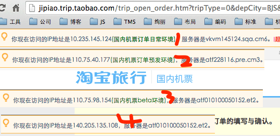
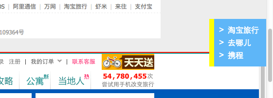
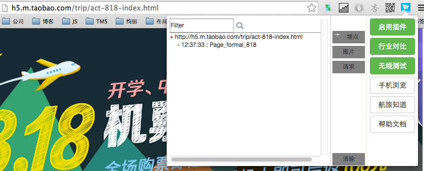
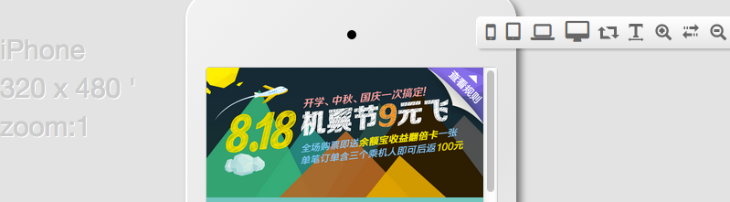
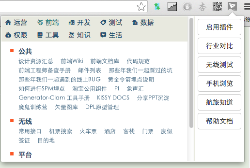

# 中秋福利等你来领 —— 航旅小二chrome插件【hudge】试用

又到中秋了，是不是还在吐槽公司的月饼太少，每年6个怎么够吃？！没关系，为了弥补大家的失落，前端团队推出了另一项福利——航旅小二chrome插件，提供7大功能，在机票团队范围内推广试用。

## 一、chrome插件能做什么？

chrome插件能做的事情，或许会超乎你的想象！host切换、一淘比价、udata、翻墙、截图、二维码生成...这些插件大家或多或少都用到过一些。只有能够获取到数据，插件可以在页面插入任何你想要的内容。

试想一下，打开机票订单填写页，插件会告诉你：是谁负责这个页面、页面的ip地址和服务器名称、哪些区块是通过TMS维护的、TMS维护地址在哪、保险接口挂掉了、登录的用户是不是常旅客、常旅客的注册姓名、为什么会下单失败、应该重选哪一个航班才能看到活动...那么，我们的开发工作，是不是会变得简单有趣得多呢？

是的，hudge就是为了提升大家的开发效率，把所有流程、协作、非系统 的烦人工作统统抽象入工具，提供一“件”式服务。

## 二、hudge现在（一期）能做什么

hudge现在（一期）已经实现的功能，请[点击查这里查看](http://groups.alidemo.cn/chishang/hudge/md/)。

为什么说是现在呢？因为hudge能做的，远远超过下面例举出来的功能。但是，我们需要时间去开发和挖掘。所以在试用过程中，欢迎大家将反馈意见和需求提给 @迟伤（单独旺旺我或者发邮件给我都行）。

1.页面TMS模块直接维护
---
* 用户：<strong style="color:red">运营 </strong>
* 功能：在线上页面直接显示TMS维护入口
* 场景：找不到TMS编辑地址；不知道区块内容是vm维护还是TMS维护的

	运营童鞋的福利来了！每次要维护一个页面，是不是都要问一圈人才能找到页面维护地址？当你看到页面因为TMS填错猛然抓瞎不知道该找谁处理时，这个插件能极大缩短bug存活时间。启用插件后，TMS编辑入口会直接在页面显示，点击编辑链接之后，将直接带你到TMS编辑页面。

	

	对于前端同学来说，如果是活动页面，会自动根据meta属性生成。如果是频道页面或者区块，需要增加的工作量是加上专用属性（data-hudge-tmsid 对应tms页面的id参数,必须有；data-hudge-tmstitle 对应内容的简单说明，方便运营确认自己维护的对不对，建议加上）。

		

			<cms:xxx>
				xxx
			</cms:xxx>
		

	
	
2.前端页面owner反馈
---
* 用户：所有小二
* 功能：显示页面的前端相关人员
* 场景：发现线上问题，不知道找谁处理

	发现页面有问题的时候该找谁？产品？测试？开发？都可以！但是，可以很自豪的说，就算前端不是对这个页面最了解的，也绝对是对该找谁处理这个问题最了解的。

	每个页面，我们都会给你展示前端owner，不管对不对得上，找他就对了。

	

3.测试环境ip和服务器信息展示
---

* 目标用户：<strong style="color:red">测试</strong>
* 功能：显示日常项目环境的ip地址和服务器信息；日常环境和线上环境一键切换
* 场景：host切换后，不知道有没有生效；想知道页面是否访问了对应的测试环境

	对于开发和测试童鞋来说，平时最痛苦的莫过于各种测试环境切换了。我到底在哪套环境？host切换有没有生效？插件会在页头直接展示当前页面ip，让答案变得更直观。

    另外，也提供了线上环境和日常环境的対切，免去大家手动改url或者翻收藏夹的痛苦。

	

4.行业对比
---

* 用户：所有小二
* 功能：和携程、去哪儿的页面对比
* 场景：搜索国内(国际)机票的时候，想知道与携程、去哪儿相比，哪一家更有价格优势

	目前已经提供的有**“特别推荐”**的【[国内机票搜索页面对比](http://s.jipiao.trip.taobao.com/flight_search_result.htm?spm=181.7091613.a1z67.1001&searchBy=1280&tripType=1&depCityName=%C9%CF%BA%A3&depCity=SHA&depDate=2014-09-15&arrCityName=%C9%EE%DB%DA&arrCity=SZX&arrDate=2014-09-27#J_TSiteNav)、[国际机票搜索页面对比](http://s.ijipiao.trip.taobao.com/ie/flight_searcher.htm?searchBy=1281&tripType=1&depCityName=%B9%E3%D6%DD&depCity=CAN&arrCityName=%B0%C4%C3%C5&arrCity=MFM&depDate=2014-09-29&arrDate=2014-10-12#xiecheng)】、【所有频道页面在淘宝旅行、携程、去哪儿的对比】。以后还会开发更多更好玩的功能。

	这个功能可以方便我们在购买机票的时候，实时实地地对比淘宝旅行、去哪儿、携程的价格。点亮“行业对比”按钮，在页面右侧会有一个导航出现（如果没有，说明这个页面还没有对比功能），点击导航链接，就可以看到效果了。

	

	

5.无线测试
---

* 用户：<strong style="color:red">无线</strong>
* 功能：观察aplus埋点、页面请求、图片质量
* 场景：查看aplus埋点；检测图片质量是否合格

	感谢卜居提供的功能——在Chrome中测试H5页面时，更新直观的将aplus埋点显示出来，省去在js.do请求中找参数的时间。

	
	

6.手机浏览页面
---

* 用户：所有小二
* 功能：在虚拟的手机容器中查看页面展示效果
* 场景：开发完成了一个页面，想先在多终端简单查看一下适配行

	这个功能主要是方便大家做多终端的适配性测试。  使用方法：点击导航栏的航旅插件图标，在弹出的配置框中点击“手机浏览”按钮

	

7.航旅导航
---

* 用户：所有小二
* 功能：页面导航，各种wiki入口
* 场景：记得以前浏览过一个wiki页面，但怎么也找不到了

	清新、齐全的航旅导航，师兄再也不用担心我找不到页面入口了。

	
	

## 三、后续（二期）工作计划

二期计划重点优先完成以下几个方向：

* TMS数据填写
* 机票搜索和订单业务深入
* 无线功能支持

另外，我们也会接受大家的私人订制，深入业务，解决实际问题。

## 四、如何安装和更新

安装：

* 打开Chrome，在地址栏中输入 chrome://extensions
* 将[下载](hudge_extension.crx)好的 .crx 文件，拖到chrome的**扩展程序**页面中
* 弹出 "确认新增扩展程序" 提示框时，点击 "添加"
* 安装成功后，Chrome浏览器工具栏上会增加一个 "淘宝旅行" 的icon

更新：

* 打开Chrome，在地址栏中输入 chrome://extensions
* 点击“立即更新扩展程序”按钮（需要勾选“开发者模式”。由于目前更新地址只能内网访问，所以更新的时候务必使用内网或者连接VPN）
* 如果点击后插件的版本号没有改变，说明升级失败了。这个时候，还是老老实实的再次将[下载](hudge_extension.crx)好的 .crx 文件，拖到chrome的**扩展程序**页面中吧。

## 五、感谢

* “无线测试”功能实现：卜居
* “TMS链接和行业对比”idea：舒克
* “测试环境和服务器显示”idea：秋雁
* “导航”搭建：银翘

 

